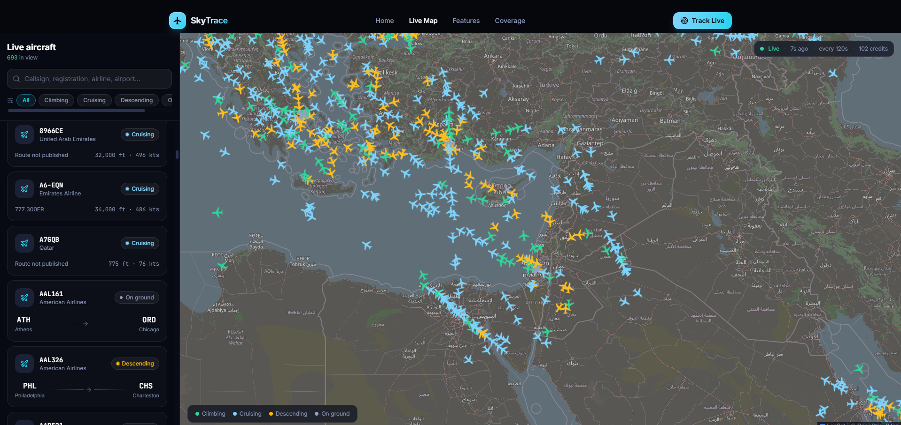
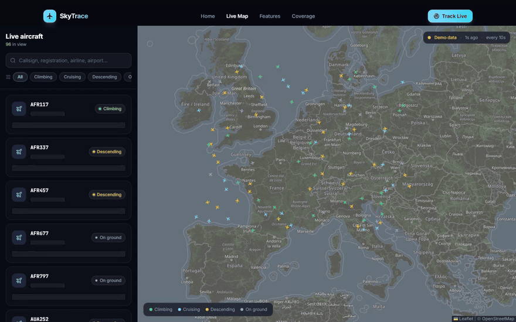
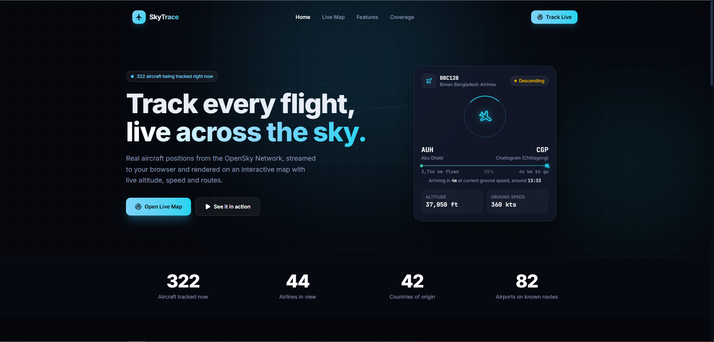
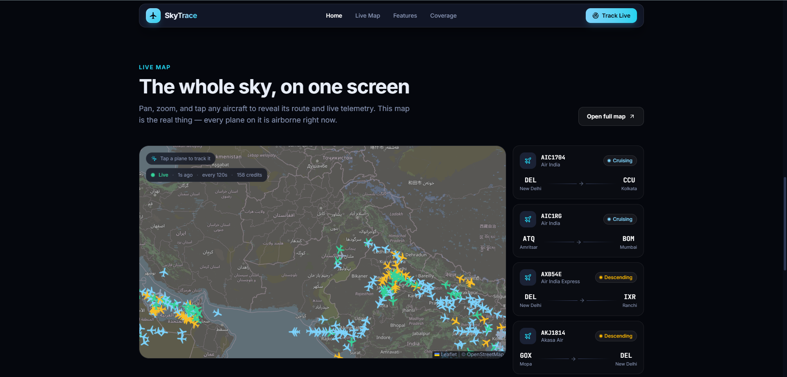

# SkyTrace

Live ADS-B flight tracking: one shared OpenSky poller, a WebSocket fan-out, and a canvas map that keeps moving between updates.



<p align="center">
  
</p>

> Non-commercial portfolio project. Positions come from the [OpenSky Network](https://opensky-network.org/). When the live feed is unreachable, the server loops a recorded fixture and the UI labels it **Demo data** — never as live.

---

## Why it is built this way

A registered OpenSky account gets **4,000 API credits per day**. A global `/states/all` costs 4 credits; a bounding box under 25 square degrees costs 1. The data itself only refreshes every 5–10 seconds, so polling faster than that spends credits without gaining freshness.

Polling globally every 10 seconds would burn the daily budget in under three hours. That constraint is the architecture:

- **One poller for every connected client**, not one request per browser tab
- **Viewport-derived bounding boxes**, coalesced so adjacent viewers share a query
- **Idle when nobody is watching**
- **Client-side dead reckoning** so a 10-second update still looks like 60fps motion
- **Replay fallback** so a demo link never shows an empty map

```mermaid
flowchart LR
    OpenSky["OpenSky /states/all"] -->|"OAuth2, bbox, 10s"| Poller[TrackingService]
    Poller --> Store[(In-memory state map)]
    Store -->|"snapshot + deltas"| Gateway[WebSocket /stream]
    Gateway <-->|"viewport:set"| Client[React client]
    Client --> Interp[Dead-reckoning rAF]
    Interp --> Canvas[Leaflet canvas layer]
    Store -->|"new icao24 / callsign"| Queue[Enrichment queue]
    Queue -->|"rate limited"| Adsbdb[adsbdb.com]
    Adsbdb --> PG[(PostgreSQL cache)]
    PG -->|"aircraft:enriched"| Gateway
    Poller -.->|"OpenSky down or out of credits"| Replay[Replay fixture]
    Replay --> Store
```



Positions render immediately. Aircraft type, airline, and typical route arrive a moment later and are cached.

A longer walkthrough — flow, stack, APIs, code layout, and the challenges that shaped the design — is in [docs/ARCHITECTURE.md](docs/ARCHITECTURE.md).

---

## Features

- Live positions from OpenSky, streamed over Socket.IO (`states:snapshot`, then `states:delta`)
- Custom Leaflet **canvas layer**: rotated plane sprites, viewport culling, zoom LOD, spatial-grid hit-testing
- Dead-reckoning interpolation with a short ease-in when the next authoritative update lands
- Flight phase derived from ADS-B (`on-ground` / `climbing` / `cruising` / `descending`)
- Optional route and airframe enrichment via [adsbdb](https://www.adsbdb.com/), labelled as the **typical** route for a callsign, not confirmed origin/destination
- Search by callsign, registration, airline, or airport
- Connection badge with feed source, last-poll age, poll interval, and remaining credits
- Landing page, full live map (`/live`), and per-aircraft detail (`/flight/:icao24`)





---

## Stack

| Layer | Technology |
| --- | --- |
| Frontend | React 19, TypeScript, Vite, Tailwind CSS v4, React Router, Framer Motion |
| Map | Leaflet + react-leaflet, custom canvas overlay, OpenStreetMap tiles |
| Realtime | Socket.IO (`/stream`) |
| Backend | NestJS 11, Express adapter |
| Data | OpenSky REST (OAuth2 client credentials), adsbdb |
| Cache | PostgreSQL + TypeORM, or in-memory when `DB_HOST` is unset |
| Shared contracts | `packages/shared` (`AircraftState`, bbox helpers, wire events) |

---

## Repository layout

```text
skytrace/
├─ apps/
│  ├─ frontend/          React SPA
│  └─ backend/           NestJS API + WebSocket gateway
│     └─ fixtures/       Replay snapshot used when OpenSky is down
├─ packages/shared/      Types and geo helpers used by both apps
├─ scripts/              Fixture recording, demo fixture, README capture
└─ docs/                 Architecture walkthrough, screenshots, preview recording
```

---

## Getting started

**Prerequisites:** Node.js 18+ and npm.

```bash
git clone <this-repo>
cd skytrace
npm install

# optional: copy env and add OpenSky OAuth2 client credentials
cp apps/backend/.env.example apps/backend/.env

# two terminals
npm run dev:backend    # http://localhost:3000
npm run dev:frontend   # http://localhost:5173
```

Without OpenSky credentials the API uses **anonymous** access (400 credits/day). Create an API client at [your OpenSky account](https://opensky-network.org/my-opensky/account) and set `OPENSKY_CLIENT_ID` / `OPENSKY_CLIENT_SECRET` for the 4,000-credit tier.

PostgreSQL is optional. Leave `DB_HOST` blank and enrichment caches in memory for the process lifetime.

Frontend talks to the API through `VITE_API_URL` (defaults to `http://localhost:3000`). See [apps/frontend/.env.example](apps/frontend/.env.example).

### Useful scripts

| Script | What it does |
| --- | --- |
| `npm run test` | Shared build, then Jest (backend) and Vitest (frontend) |
| `npm run typecheck` | Typecheck all workspaces |
| `npm run record:fixture` | Capture a live OpenSky slice into `apps/backend/fixtures/states-replay.json` |
| `npm run fixture:demo` | Generate the committed demo fixture (no live feed required) |
| `npm run docs:capture` | Screenshot + record the UI (servers must already be running) |

### Replay modes

`REPLAY_MODE` in the backend env:

| Value | Behaviour |
| --- | --- |
| `auto` (default) | Serve the fixture when OpenSky fails or returns 429 |
| `always` | Always serve the fixture — used for the README recording |
| `off` | Never fall back; the map is empty if the feed is down |

---

## Credit budget

OpenSky prices `/states/all` by bounding-box area. The poller:

1. Collects every subscribed viewport
2. Merges boxes when the union costs no more than querying them separately
3. Caps requests per cycle (`POLL_MAX_REQUESTS_PER_CYCLE`, default 3)
4. Widens the poll interval as `X-Rate-Limit-Remaining` falls
5. Stops entirely at zero subscribers

Client-side interpolation fills the gap between polls. Hidden tabs disconnect after 30 seconds so a backgrounded browser does not keep the poller alive.

---

## Honest limitations

- **OpenSky terms** require a written agreement for commercial or operational use. This app is a non-commercial portfolio piece.
- **Routes are hypotheses** from published schedules (adsbdb), not observed tracks. The UI treats them as the typical route for that callsign.
- **Major cloud IP ranges** (AWS, GCP, Azure) may be blocked by OpenSky. A Vercel-hosted backend would not see live data; replay exists for that case.
- **Boarding / delayed / scheduled** cannot be derived from ADS-B. Status is on-ground vs airborne phase only.
- **adsbdb** is a volunteer service. Enrichment is rate-limited, cached, and never allowed to block the position stream. Some lookups return 400 for unknown hex codes.
- Features that are **not** built: alerts, favourites, route playback, authentication.

---

## License

[MIT](./LICENSE) © 2026 Muhammad Shahbaz.

Flight positions: [OpenSky Network](https://opensky-network.org/). If you use OpenSky data in a publication, cite Schäfer et al., IPSN 2014.
