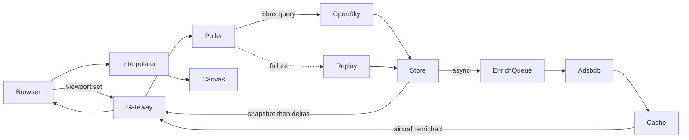
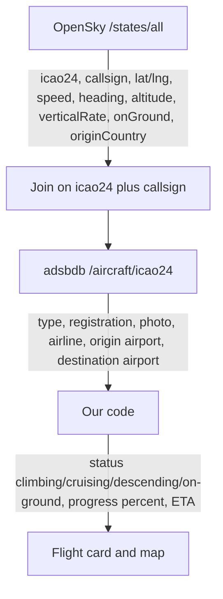
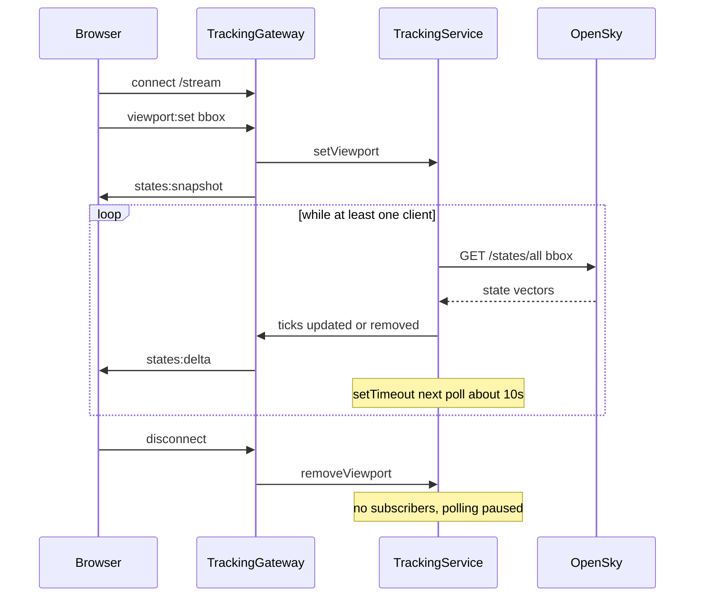

# SkyTrace — how the system works

A walkthrough you can give to another engineer: the problem, the flow, the stack, the code layout, and the challenges that shaped the design.

This is a **non-commercial** portfolio project. Positions come from the [OpenSky Network](https://opensky-network.org/). When the live feed is unreachable, the server loops a recorded fixture and the UI labels it **Demo data** — never as live.

---

## What it is

SkyTrace is a live flight tracker. You open a map, aircraft appear over the area you are looking at, they keep moving, you tap one and see altitude, speed, heading, and — if we know it — a typical origin and destination.

It is not FlightRadar24. It is a system designed around a hard constraint: the live data is expensive, slow, and incomplete. Almost every design choice comes from that.

---

## The constraint that is the design

Positions come from the OpenSky Network ADS-B REST API.

- A registered account gets **4,000 credits per day**. Anonymous access is **400**.
- A **global** `/states/all` query costs **4 credits**. A bounding box under 25 square degrees costs **1**.
- The data itself only refreshes every **5–10 seconds**. Polling faster wastes credits without gaining freshness.

If every browser tab hit OpenSky itself, or if the server polled the whole world every 10 seconds, the daily budget would die in a few hours.

So the product is:

1. **One shared poller** — not one request per tab
2. **Query only what people are looking at**
3. **Make a 10-second feed look smooth on the client**

---

## High-level flow

1. The browser opens a **WebSocket** to the NestJS API (`/stream`).
2. The map reports its visible area: `viewport:set { bbox, zoom }`.
3. The server has **one** OpenSky poller. If this is the first viewer, polling starts. If others are already watching nearby, their boxes are **merged** so OpenSky is not queried twice for the same sky.
4. OpenSky returns raw state vectors (position, heading, speed, altitude, callsign, Mode-S hex). Those go into an **in-memory map** keyed by `icao24`.
5. That client gets a **snapshot**. After that, only **deltas** (updated + removed).
6. In parallel, unknown aircraft go on an **enrichment queue** to adsbdb (type, registration, typical route). That path is slow and optional. **Positions never wait for it.**
7. The browser **dead-reckons** each aircraft between updates (project along heading at ground speed) and draws them on a **canvas** over Leaflet — not as thousands of DOM markers.
8. If OpenSky is down, out of credits, or blocked, the server loops a **recorded fixture** and the UI says **Demo data**.

When the last tab closes, polling **stops**. Hidden tabs disconnect after 30 seconds so a laptop in another room does not keep burning credits.



---

## Two tiers of data

**Hot path — positions.** Must never block. In-memory. ~10s cadence. This is what the map is.

**Cold path — identity.** Aircraft type, photo, airline, typical route. Cached in PostgreSQL if `DB_HOST` is set, otherwise in RAM for the process lifetime. Fills in a moment later; the card shows a skeleton until then.

OpenSky does **not** give origin airport, destination, airline name, or aircraft type. It gives: this hex is at this lat/lng, flying this heading, this fast. That is why enrichment exists, and why a route is never presented as GPS-truth. adsbdb resolves a **callsign against published schedules**. The UI treats it as “typical route for this callsign.”



| What you see | Where it comes from | Notes |
| --- | --- | --- |
| Callsign, position, speed, heading, altitude, squawk | **OpenSky** | Broadcast by the transponder |
| Origin country | **OpenSky** `origin_country` | Country of **registration**, not the departure airport |
| Aircraft type, registration, photo, airline | **adsbdb** | Looked up by Mode-S hex + callsign |
| Origin / destination airports | **adsbdb** flightroute | Schedule guess for that callsign, not a GPS track |
| Status (climbing / cruising / descending / on ground) | **Derived** | From `onGround` and `verticalRate` (> 1.5 m/s = climbing) |
| Progress % and ETA | **Derived** | Great-circle distance vs current speed, only when a route exists |

If adsbdb 404s or has no route, the card still works: callsign + country + telemetry, no airport bar.

---

## Tech stack

| Layer | What we use | Why |
| --- | --- | --- |
| Frontend | React 19, TypeScript, Vite, React Router | SPA: landing `/`, live map `/live`, detail `/flight/:icao24` |
| Styling / motion | Tailwind CSS v4, Framer Motion | Landing polish; the live map is mostly canvas |
| Map | Leaflet + react-leaflet, custom canvas layer, OpenStreetMap tiles | Leaflet for pan/zoom/tiles; canvas for the planes |
| Realtime | Socket.IO namespace `/stream` | Snapshot, delta, enrichment, and stream status |
| Backend | NestJS 11 on Express | Modules, DI, WebSocket gateway |
| Shared package | `@skytrace/shared` | Same types and geo math on both sides |
| Positions API | OpenSky REST, OAuth2 client credentials | Live ADS-B |
| Enrichment API | [adsbdb.com](https://www.adsbdb.com/) (no API key) | Airframe + schedule route |
| Cache | PostgreSQL + TypeORM, or in-memory | Optional DB so a local demo still works |
| Tests | Jest (backend), Vitest (frontend) | Token, 429, bbox cost, interpolation |

**Not in the repo:** user auth, alerts, favourites, Docker/Fly deploy, GitHub Actions, Playwright e2e tests (a script name exists; the tests do not).

---

## Third-party APIs

### OpenSky Network

- **Endpoint:** `GET /states/all` with `lamin`, `lomin`, `lamax`, `lomax`
- **Auth:** OAuth2 client credentials (basic auth ended March 2026). Tokens last ~30 minutes; we refresh early and retry once on 401. Blank credentials fall back to anonymous access (400 credits/day).
- **Credits:** We read `X-Rate-Limit-Remaining` and surface it in the UI. On 429 we honour `X-Rate-Limit-Retry-After-Seconds`, stretch the poll interval, and in `auto` replay mode fall back to the fixture.

### adsbdb

- **Endpoint:** `GET /v0/aircraft/{icao24}?callsign=...`
- **Returns:** Airframe (type, registration, photo) and, when known, a flightroute (airline, origin, destination).
- **Honesty:** Routes are schedule-derived, not observed tracks.
- **Limits:** Volunteer-run, roughly 512 requests per window. We cap ourselves at ~4 req/s, cache airframes indefinitely, TTL routes, and negative-cache unknown hexes. HTTP 400/404 must not stall the map.

### OpenStreetMap tiles

Raster tiles under the canvas. CARTO was the original dark basemap; they watermark without an API key, so the app uses OSM and CSS-filters the tiles to keep the dark look.

---

## Wire protocol

Streaming uses **Socket.IO** on NestJS (`@nestjs/platform-socket.io`), namespace `/stream`. The TCP connection stays open; the server **pushes** events. There is **no cron job** and no `@nestjs/schedule`.

A demand-driven `setTimeout` poller in `TrackingService` fetches OpenSky only while at least one client is subscribed. Default gap is ~10s (OpenSky’s own refresh rate). Last tab disconnects → timer is cleared → polling stops.



| Event | When | What |
| --- | --- | --- |
| `states:snapshot` | Once, on `viewport:set` | All aircraft currently in that box |
| `states:delta` | After each poll, if anything changed | `{ updated[], removed[] }` |
| `aircraft:enriched` | When adsbdb answers | Type, route, photo |
| `stream:status` | After polls / connect | live vs replay, credits, interval |

Identical vectors are dropped (`hasMeaningfulChange`) so the browser is not spammed with the same plane every cycle.

Namespace: `/stream` (`packages/shared/src/wire.ts`).

| Direction | Event | Payload |
| --- | --- | --- |
| Client → server | `viewport:set` | `{ bbox, zoom }` |
| Server → client | `states:snapshot` | `{ aircraft[], serverTime }` |
| Server → client | `states:delta` | `{ updated[], removed[], serverTime }` |
| Server → client | `aircraft:enriched` | `{ items[] }` |
| Server → client | `stream:status` | `{ source, creditsRemaining, pollIntervalMs, lastPollAt, aircraftInFeed }` |

`source` is `live` | `replay` | `starting` | `unavailable`. The UI maps `replay` to the **Demo data** badge.

REST is thin:

- `GET /health`
- `GET /aircraft/:icao24` — so a detail URL can resolve without opening a stream

---

## System design, in the order you would implement it

### 1. Shared contracts — `packages/shared`

`AircraftState`, `Bbox`, socket event names, `bboxCreditCost()`, great-circle `destinationPoint()`. Frontend and backend must agree or deltas become garbage.

### 2. One poller — `TrackingService`

Not “one HTTP request per client.” A map of subscribers → their bbox. `planQueries()` merges boxes when the union is cheaper than two queries. Cap of 3 OpenSky requests per cycle. Adaptive interval as credits fall. Idle at zero subscribers.

### 3. Gateway — `TrackingGateway`

On connect: `stream:status`. On `viewport:set`: snapshot of aircraft in that box, then deltas only for that client’s box. Enrichment events are filtered the same way. Someone zoomed on France does not receive the whole world.

### 4. Client store — `useLiveAircraft`

Applies snapshot / delta / enrichment into a `Map`. Debounces pan/zoom (~300ms) and **pads** the bbox slightly so small pans reuse data. Disconnects after 30s hidden.

### 5. Interpolation — `PositionInterpolator`

Between OpenSky fixes: fly along last heading at last speed (same geodesy as server replay). When a new fix arrives, ease toward it over ~500ms so the plane does not teleport.

### 6. Canvas layer — `AircraftCanvasLayer`

One canvas, sprites pre-drawn offscreen, `drawImage` + rotate. Cull off-screen. Zoomed out: dots. Zoomed in: plane glyphs. Clicks: spatial grid, nearest hit. A Leaflet `Marker` per plane would collapse around a few hundred aircraft.

### 7. Enrichment — `EnrichmentService` + queue + store

Cache first. Misses enter a serial rate-limited queue. Persist. Push `aircraft:enriched`. Postgres if `DB_HOST` is set; otherwise a process-lifetime Map.

### 8. Replay — `ReplaySource`

JSON fixture of traffic. Aircraft are advanced along their recorded tracks with the same `destinationPoint` math. Timestamps are rewritten to “now” so the client interpolator does not treat them as stale. Badge: **Demo data**.

Replay modes (`REPLAY_MODE`):

| Value | Behaviour |
| --- | --- |
| `auto` (default) | Fixture when OpenSky fails or returns 429 |
| `always` | Always serve the fixture (docs / capture) |
| `off` | Never fall back; empty map if the feed is down |

---

## Code structure

```text
skytrace/
  packages/shared/          types, geo, socket event names
  apps/backend/src/
    config/                 env → AppConfig
    modules/opensky/        token, HTTP client, array → object mapper
    modules/tracking/       poller, gateway, viewport planner, replay, GET /aircraft/:icao24
    modules/enrichment/     adsbdb, queue, TypeORM / memory stores
    fixtures/               replay snapshot
  apps/frontend/src/
    pages/                  Landing, Live, FlightDetail
    hooks/                  useLiveAircraft
    lib/                    socket, interpolation, geo, aircraft-view
    components/map/         FlightMap, canvas layer, sprites
    components/ui/          ConnectionStatus, skeletons
  scripts/                  record fixture, generate demo fixture, capture docs
  docs/                     screenshots, preview GIF, this document
```

### Backend — where to look

| File | What it does |
| --- | --- |
| `apps/backend/src/main.ts` | Loads dotenv first (config is read at import time), CORS, Socket.IO adapter |
| `apps/backend/src/app.module.ts` | Optional TypeORM; wires `TrackingModule` |
| `modules/tracking/tracking.service.ts` | The single poller and in-memory store |
| `modules/tracking/tracking.gateway.ts` | Fan-out: snapshot, delta, enrichment, status |
| `modules/tracking/viewport.ts` | Merge client boxes into the cheapest OpenSky query plan |
| `modules/tracking/poll-interval.ts` | Stretch the poll gap as credits run down |
| `modules/tracking/replay.source.ts` | Fixture loop with projected motion |
| `modules/opensky/opensky-token.service.ts` | OAuth2 token cache, early refresh, single-flight |
| `modules/opensky/opensky.client.ts` | `/states/all`, credit headers, 429 / 401 |
| `modules/opensky/state-vector.mapper.ts` | OpenSky positional arrays → `AircraftState` |
| `modules/enrichment/enrichment.service.ts` | Cache → queue → persist → `enriched$` |
| `modules/enrichment/enrichment.queue.ts` | Rate-limited serial queue |
| `modules/enrichment/adsbdb.client.ts` | HTTP mapping into shared enrichment types |

`main.ts` must import `dotenv/config` before other modules because configuration is read at import time to decide whether Postgres is registered.

### Frontend — where to look

| File | What it does |
| --- | --- |
| `apps/frontend/src/App.tsx` | Routes: `/`, `/live`, `/flight/:id` |
| `pages/LivePage.tsx` | Full-screen map + search/filters (sidebar capped at 150 rows) |
| `hooks/useLiveAircraft.ts` | Socket lifecycle, viewport, aircraft `Map` |
| `lib/socket.ts` | Socket.IO client, reconnect backoff |
| `lib/interpolation.ts` | Dead reckoning + ease-in on new fixes |
| `lib/geo.ts` | Great-circle helpers for route arcs |
| `lib/aircraft-view.ts` | Turns state + enrichment into UI view models |
| `components/map/FlightMap.tsx` | Leaflet shell, OSM tiles, viewport reporter |
| `components/map/AircraftCanvasLayer.tsx` | Planes, culling, LOD, click hit-testing |
| `components/ui/ConnectionStatus.tsx` | Live / Demo data / unavailable + poll age + credits |

The map draws every aircraft in the viewport. The sidebar is DOM and would choke, so it lists at most 150 and says so.

---

## Challenges and how they were handled

**OpenSky credits.**  
One poller, bbox queries, merge-if-cheaper, max 3 requests per cycle, slower polling as remaining credits drop, stop when nobody is subscribed, disconnect idle tabs.

**OAuth2 (March 2026).**  
Username/password is gone. Client ID/secret → bearer token, refresh before expiry, one retry on 401.

**OpenSky returns arrays, not objects.**  
A dedicated mapper turns positional indexes into `AircraftState`. Easy to get wrong; it has unit tests.

**Cloud IPs blocked.**  
AWS / GCP / Azure ranges are often blocked. A Vercel-hosted API would see an empty sky. Replay exists so a demo never shows a blank map. Honest badge, not fake “Live”.

**10-second updates look like a slideshow.**  
Client dead reckoning plus a short ease toward each new authoritative fix. Server replay uses the same projection so demo mode still moves.

**Thousands of DOM markers.**  
Custom canvas layer: offscreen sprites, culling, zoom LOD, spatial click grid.

**OpenSky has no routes.**  
adsbdb, async, cached, labelled as typical/schedule — not “this plane took off from IST.”

**adsbdb is flaky and rate-limited.**  
Token-bucket queue, never block positions, 404/400 do not crash the poller, negative cache so unknown hexes are not retried forever.

**Postgres should not be required to run the demo.**  
`DB_HOST` unset → memory store. Enrichment still works until the process dies.

**CARTO watermarks.**  
Switched to OpenStreetMap tiles so screenshots and the live map do not show “API KEY REQUIRED”.

**Hidden tabs.**  
30s idle disconnect so background tabs do not keep the poller alive.

**What we did not pretend to solve.**  
Boarding / delayed / scheduled cannot be derived from ADS-B — status is on-ground, climbing, cruising, or descending. No auth, alerts, or historical playback. No production deploy in this repo.

---

## The 30-second version

SkyTrace is a live ADS-B map. The interesting part is not drawing planes — it is that OpenSky meters you by the day, so we run **one** poller, only fetch the viewports people are looking at, and interpolate on the client so a 10-second feed still looks live. Identity and routes come from a second API, asynchronously, and if the live feed dies we replay a fixture and say so.

---

## Related

- [Root README](../README.md) — setup, env vars, scripts
- Screenshots: [live](screenshots/live.png?v=2), [landing](screenshots/landing.png?v=2), [landing map](screenshots/landing-map.png?v=2)
- Preview recording: [preview.gif](preview.gif)
